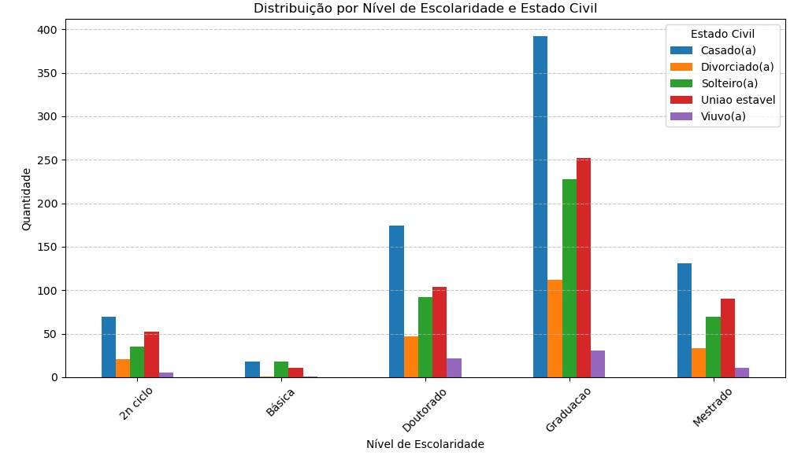

# Análise de Perfil de Clientes — Varejo de Alimentos

## Introdução

Este projeto tem como objetivo analisar o perfil dos clientes de uma empresa de **varejo de alimentos**, com base em dados tabulares. O foco está em identificar padrões de comportamento de compra, analisar características demográficas relevantes e testar hipóteses que apoiem decisões estratégicas de marketing e negócios.

---

## Principais Descobertas

- **Clientes sem filhos gastam, em média, quase 3 vezes mais** que clientes com filhos.  
  *Mesmo com outliers entre os clientes com filhos, a diferença no gasto permanece estatisticamente significativa (teste de Mann-Whitney U, p < 0,05), com 95% de confiança.*
  
- **Renda e gasto estão fortemente correlacionados** (r = 0,82).
- **Maior nível educacional** está associado a **maior renda e maior gasto**.
- Embora 72% da base possua filhos, **clientes sem filhos são responsáveis por 52% do faturamento**.
- Cerca de **80% dos clientes não aceitaram nenhuma campanha**, indicando a necessidade de melhorar a segmentação e a abordagem das ações de marketing.
- O **Top 10 (e até Top 20) clientes com maior gasto** não possuem filhos.
- **Gastos regulares representam 92% do total gasto pelos clientes**, sendo que **clientes sem filhos concentram 53,5% desse valor**.

---

## Características dos Clientes



- **88,5% dos clientes possuem escolaridade entre graduação e doutorado**, sendo que **50% têm ensino superior completo**.  
    A renda média desse grupo varia entre **52 mil e 55 mil reais ao ano**, com gasto médio mensal entre **570,00 e 630,00**.

- **O estado civil mais frequente é**:
  - Casado (38,8%)  
  - União estável (25,2%)  
  - Solteiro (21,9%)  
  - Divorciado (10,6%)  
  - Viúvo (3,5%)

--

- **Perfil familiar com filhos**:
  - 50,8% dos clientes têm um filho, sendo a maioria casados (20,4% da base total).  
    - Dentro do grupo de clientes casados, 52,5% têm um filho (412 de 785).
  - 28,1% dos clientes não têm filhos, também com predominância entre os casados (10% da base total)..  
    - Entre os clientes casados, 25,7% não têm filhos (202 de 785)..  

*Ou seja, 78,9% dos clientes possuem nenhum ou apenas um filho, representando um grupo majoritário e estratégico para ações de segmentação familiar.*

---

## Hipóteses Testadas

1. **Há diferença no gasto total entre clientes com e sem filhos?**  
   Confirmada via teste **Mann-Whitney U** (p < 0,05)

2. **Clientes com maior renda gastam mais?**  
   Confirmada via **correlação de Pearson** (r = 0,82)

3. **Há diferença de consumo entre perfis familiares?**  
   Sim. Clientes sem filhos consomem mais.

---

## Metodologia Estatística

- **Normalidade**: Shapiro-Wilk → Distribuição **não normal**
- **Homogeneidade**: Levene → **Variâncias diferentes**
- **Teste aplicado**: **Mann-Whitney U**

### Conclusão estatística:

Com base no teste de Mann-Whitney U (p < 0.05), podemos afirmar com 95% de confiança que existe diferença significativa nos gastos totais entre pessoas com e sem filhos.  
Ou seja, os dois grupos apresentam perfis de consumo distintos.

### Interpretação para o negócio:

Mesmo sem assumir normalidade, o teste mostrou que clientes com e sem filhos têm comportamentos de gasto distintos — o que reforça a necessidade de abordagens diferentes em ações de marketing.

---

## Recomendações Estratégicas

### Clientes com filhos (72% da base)
- Criar **combos e ofertas familiares** com melhor custo-benefício
- Testar **novos formatos de campanha**: educativas, sensíveis ao orçamento familiar
- Foco em **benefícios funcionais e práticos** (economia, nutrição, conveniência)
- Implementar **ações de fidelização e retenção**, visando aumento na frequência de compra

### Clientes sem filhos (28% da base)
- Campanhas voltadas para **produtos premium e gourmet**
- Investimento estratégico: **alto ticket médio e maior engajamento**
- Ofertas personalizadas e **experiências exclusivas** (ex: assinaturas, boxes surpresa)
- Explorar **cross-sell e upsell**, aproveitando a maior propensão à experimentação

---

## Organização do Projeto

```
├── .gitignore                       <- Arquivos e diretórios ignorados pelo Git
├── ambiente_github_projeto1.yml     <- Arquivo de requisitos para reproduzir o ambiente
├── LICENSE                          <- Licença de código aberto (MIT)
├── README.md                        <- Descrição geral do projeto

├── dados/                           <- Arquivos de dados (não disponibilizados)
├── notebooks/                       <- Jupyter Notebooks de análise e limpeza
├── imagens/                         <- Imagens utilizadas no projeto
├── referencias/                     <- Dicionário de dados

└── src/                             <- Código-fonte
    ├── __init__.py                  <- Torna um módulo Python
    ├── config.py                    <- Configurações básicas do projeto
    └── funcoes_projeto1.py          <- Funções utilizadas no projeto
```

---

# Configuração do ambiente

1. Faça o clone do repositório.

    ```bash
    git clone git@github.com:Rafael-L-Jorge/1-Analise_Perfil_Clientes_VarejoAlimentos.git
    ```

2. Crie um ambiente virtual para o seu projeto utilizando o `conda`.

   ```bash
   conda env create -f ambiente_github_projeto1.yml --name estatistica
   ```

## Dicionário de Dados

[Clique aqui](referencias/01_dicionario_de_dados.md) para ver o dicionário de dados da base utilizada.

---

## Fonte dos Dados

Os dados utilizados neste projeto foram fornecidos pelo curso **Estatística do Básico ao Avançado (EBA)**.